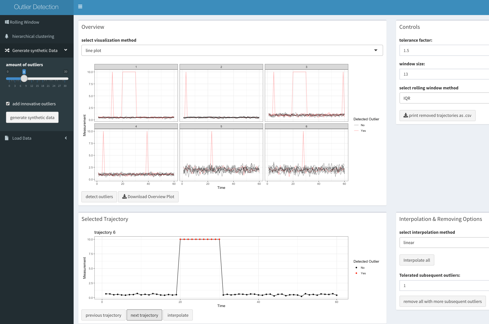
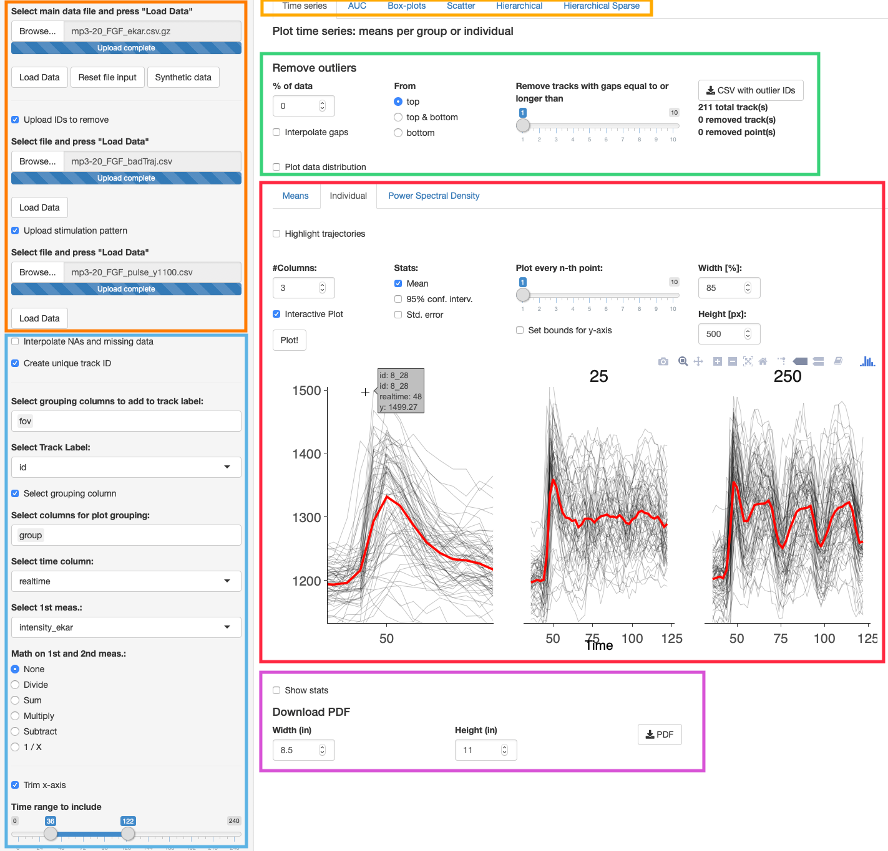

# Description

This notebook accompanies the **QUANTBIO2019** workshop. It contains placeholders `(...)` to fill the code in exercises presented during the workshop.

You can *knit* this document into an HTML file. Once you fill in the code, change the parameter `eval=F` to `eval=T`.

# Exercise 1: read data

## Read single-cell data 

Read data from a single experiment from this file `./data/original/tCoursesSelected_EGFsust_exp20170316.csv.gz`. Use `data.table::fread` function.

```{r, eval = F}
# load required R packages
require(R.utils)
require(data.table)

# read the file
dtEGF = ...

# view first couple of lines of this dataset
head(dtEGF)
```

## Read experimental description

The experimental description is located in this Excel file `./data/original/experimentDescription_EGFsust.xlsx`.

Use `readxl::read_xlsx` function.

```{r, eval = F}
require(readxl)

# the as.data.table function converts the tibble returned by read_xlsx function to a data table.
dtEGFexp = as.data.table(...)

head(dtEGFexp)
```

# Milestone 1

Data from all experiments merged into a single file:

```{r, message = F}
require(R.utils)
require(data.table)

dtAll = fread("./data/m1_allGF_wExpDescr.csv.gz")

head(dtAll)
```

**Before proceeding further**, execute the cell below. It contains definitions of column names that we will use throughout this workshop.

```{r}
# create a list with strings for column names

lCol = list(
  fov = "Metadata_Series",
  frame = "Metadata_T",
  trackid = "TrackObjects_Label",
  meas = "Intensity_MeanIntensity_Ratio",
  measNorm = "Intensity_MeanIntensity_Ratio_Norm",
  ch = "Channel",
  treatGF = "Stim_Treat",
  treatConc = "Stim_Conc",
  trackiduni = "TrackObjects_Label_Uni", # we will add this column later
  clid = "Cluster_Label"                 # we will add this column later
)
```

# Exercise 2: unique time series ID's

Create a column with unique time series ID's. It will become quite handy later on... Use `paste`, `paste0`, or `sprintf` functions to concatenate strings from different columns.

```{r, eval = F}
dtAll[, (lCol$trackiduni) := ...]

head(dtAll)
```

# Data exploration

```{r, eval = T}
summary(dtAll)
```

## Missing data

```{r, eval = T}
head(dtAll[is.na(get(lCol$meas))])
```

Check measurements of a single time series

```{r, eval = F}
dtAll[get(lCol$trackiduni) == "FGF_08_0001"][[lCol$meas]]
```


Check the length of all other time series with NA's. 

```{r, eval = F}
# make a vector with strings of unique track ids of time series that contain NA's
vsTracksWithNAs = dtAll[is.na(get(lCol$meas))][[lCol$trackiduni]]
vsTracksWithNAs

# Key the table according to a unique track ID
setkeyv(dtAll, lCol$trackiduni)

# calculate the number of time points of tracks with NA's
head(
  dtAll[vsTracksWithNAs, .N, by = c(lCol$trackiduni)], n = 12L)
```


# Exercise 3: identify missing data

Calculate the number of time points per time series. Check the min and max. The `.N` calculates the number of rows, e.g.:

```{r, eval = F}
summary(
  dtAll[, ..., ...][["N"]]
  )
```

Here, we chained two operations on a `data.table`. First, we calculated the number of rows per time series. This results in a new `data.table`. We then selected a single column named `N` from that table by using `[[...]]` syntax. 

Use `summary` function to calculate the 5-point statistics.

# Milestone 2

Dataset with interpolated `NA's` from **Milestone 2**:

```{r, message = F}
require(R.utils)
require(data.table)

dtAll = fread("./data/m2_allGF_wExpDescr_noNAs.csv.gz")

head(dtAll)
```


# Plot single-cell data

```{r, message = F, fig.align='center', fig.width= 10, fig.height=8}
require(ggplot2)
p0 = ggplot(dtAll, 
            aes_string(x = lCol$frame, y = lCol$meas, 
                       group = lCol$trackiduni)) +
  geom_path(alpha = 0.1) # parameter alpha adds transparency

p0
```


# Exercise 4A: remove point outliers

Remove single time points above the threshold **2000**, and impute them with interpolated data. Replace outlier measurements with `NA's` and interpolate them with `imputeTS::na_interpolation`.

```{r, message = F, eval = F}
# replace time points with measurements above the threshold with NA's
dtAll[... , ...]

# interpolate NA's
require(imputeTS)
dtAll[, 
      (lCol$meas) := ..., 
      by = ...]
```


# Exercise 4B: remove dynamics outliers

Remove entire trajectories if the measurement is below **1000**. Create a vector with unique track ID's for time series that have measurements below the threshold. Subset `dtAll` using that vector and `%in` operator.

# Exercise 4B: remove dynamics outliers

```{r, eval = F}
# vector with unique track id's of time series where measurements were below a threshold of 1000
vsTrackOut = unique(dtAll[...][[lCol$trackiduni]])

# Key the table according to a unique track ID column; allows for quick and easy subsetting
setkeyv(dtAll, lCol$trackiduni)

# leave only tracks that are NOT in the outlier vector
dtAll = dtAll[... %in% ...]

# clean
rm(vsTrackOut)
```

# Interactive removal of outliers

There's no single recipe for handling outliers; it all depends on the analysis.

A handy interactive tool written by Mauro Gwerder (a Bachelor student in Olivier Pertz lab) can help with that process. The R/Shiny app can be downloaded from [here](https://github.com/maurogwerder/Outlier_app) and executed from RStudio.



# Milestone 3

Dataset without outliers from **Milestone 3**:

```{r}
dtAll = fread("./data/m3_allGF_wExpDescr_noNAs_noOut.csv.gz")
```


# Plot per condition

```{r, fig.align='center', fig.width= 10, fig.height=8}
# same as above; repeated for convenience
p0 = ggplot(dtAll, aes_string(x = lCol$frame, 
                              y = lCol$meas, 
                              group = lCol$trackiduni)) +
  geom_path(alpha = 0.1) + # parameter alpha adds transparency 
  facet_grid(reformulate(lCol$treatGF, lCol$treatConc))

p0
```


# Exercise 5: normalisation

Add a column to `dtAll` with a normalised measurement where every time series is divided by the mean of its first 20 time points. Plot normalised data.

A column with the mean of first 20 elements of a group can be added this way:

```{r, eval = F}
dt[, newCol := mean(.SD[1:20, meas]), by = uniqueID]
```

`.SD` corresponds to a subset of data as defined by `by` section. It's a temporary data table and can be used as such.


```{r, eval = F}
# add a column with the mean of the beasline for every time series
dtAll[, 
      baseline := ..., # add a new column with the mean of first 20 rows of the group
      by = ...] # group by unique trajectory

# add a column with normalized measurement
dtAll[,
      (lCol$measNorm) := ...]

# remove baseline column
dtAll[, baseline := NULL]
```

# Milestone 4

Dataset with a column with normalised measurement.

```{r}
dtAll = fread("./data/m4_allGF_wExpDescr_noNAs_noOut_norm0-20.csv.gz")
```

# Plot normalised data

Plot per condition using normalized data:

```{r, fig.align='center', fig.width= 10, fig.height=8}
# same as above; repeated for convenience
p0 = ggplot(dtAll, aes_string(x = lCol$frame, 
                              y = lCol$measNorm, 
                              group = lCol$trackiduni)) +
  geom_path(alpha = 0.1) + # parameter alpha adds transparency
  facet_grid(reformulate(lCol$treatGF, lCol$treatConc))

p0
```

# Add mean to the plot

```{r, fig.align='center', fig.width= 10, fig.height=8}
p1 = p0 +
  stat_summary(
      aes_string(y = lCol$measNorm, group = 1),
      fun.y = mean, geom = "line", group = 1,
      colour = 'red', linetype = 'solid', size = 1)

p1
```


# Beautifying plots

Add themes, e.g. `+ theme_bw()`, or themes available in packages such as `ggthemes`. 

Use `+ labels()` to add the title, subtitle, the caption.

Use `+ xlab()` or `+ ylab()` to control labels of x and y axes.

```{r, message = F, fig.align='center', fig.width= 10, fig.height=8}
require(ggthemes)
p1 +
  theme_minimal() +
  labs(title = "ERK activity in response to sustained GF treatments",
       caption = paste0("Created on ", Sys.Date())) +
  xlab("Time (min)") +
  ylab("ERK activity")
```


# Exercise 6: interactive plots

Make an interactive plot. Use `plotly::ggplotly` function

```{r, message = F, eval = F, fig.align='center', fig.width= 10, fig.height=8}
require(plotly)

...
```


# Exercise 7: time point snapshots

Plot ERK activity at selected time points: baseline, peak, relaxation period. Visualise as box-, dot-, violin plots, or their combination.

Use `%in` syntax to select rows, e.g.:

```{r, eval = F}
dt[frame %in% c(10, 20, 30)]
```

Use `ggplot2` functions such as:

```{r, eval = F}
geom_boxplot()
geom_violin()
geom_dotplot(binaxis = "y", 
             stackdir = "center", 
             position = "dodge",
             binwidth = .01, 
             binpositions = "all)
```

For simplicity's sake, we will use `aes` instead of `aes_string`. Use explicit column names: `Metadata_T``, `Intensity_MeanIntensity_Ratio_Norm`.

```{r, eval = F, fig.align='center', fig.width= 10, fig.height=8}
ggplot(dtAll[...], 
       aes(x = ..., 
           y = ...) +
  ... +
  facet_grid(reformulate(lCol$treatGF, lCol$treatConc))
```


# Exercise 8: long to wide format

Convert `dtAll` to a matrix in a wide format. Use `dcast` function

```{r, eval = F}
# long to wide format
# every row corresponds to a single time series; column are time points
dtAllWide = dcast(dtAll, 
                  ... ~ ..., # place for the formula; LHS - row variable, RHS - column variable
                  value.var = '...') # place for the column name that will be cast into columns

# obtain row names for later
vsRowNames = dtAllWide[[lCol$trackiduni]]

# convert to a matrix; omit the first column
mAllWide = as.matrix(dtAllWide[, -1])

# assign row names to the matrix (useful for later plotting heatmaps from clustering)
rownames(mAllWide) = vsRowNames

# clean
rm(vsRowNames, dtAllWide)

# check the result
head(mAllWide)
```


# Hierarchical clustering

```{r, eval = F, message = F, fig.align='center', fig.width= 8, fig.height=8}
require(gplots)
heatmap.2(mAllWide)
```

## Prettify the heatmap 

```{r, eval = F, message = F, fig.align='center', fig.width= 8, fig.height=8}
require(RColorBrewer)

heatmap.2(mAllWide, 
          dendrogram = "row", Colv = F,
          trace = "none", density.info = "density",
          col = rev(colorRampPalette(brewer.pal(11, "RdYlBu"))(99)),
          xlab = "Time (min)", ylab = "Cells", key.xlab = "ERK activity")
```


## Colour dendrogram branches:

Play with parameters of `dist` and `hclust` functions. The former calculates the distance matrix between individual time series. Admissable parameters are: `euclidean`, `maximum`, `manhattan`, `canberra`, `binary` or `minkowski`. The latter performs hierarchical clustering based on the distance matrix and builds a dendrogram. Admissable parameters for dendrogram linkage in `hclust` are: `ward.D`, `ward.D2`, `single`, `complete`, `average`, `mcquitty`, `median` or `centroid`.

```{r, eval = F, message=F}
require(proxy)
require(dendextend)
require(magrittr)

# create a coloured dendrogram using a given distance and a linkage method
myRowDend  <- mAllWide %>% 
  proxy::dist(., "euclidean") %>% # calculate distance
  stats::hclust(., "complete") %>% # create a dendrogram
  stats::as.dendrogram(.) %>%
  dendextend::set("branches_k_color", k = 4) %>% # color k main branches
  dendextend::set("branches_lwd", 2) %>% # set line width of the dendrogram
  dendextend::ladderize(.) # reorganize the dendrogram
```

## Heatmap with coloured dendrogram

```{r, eval = F, fig.align='center', fig.width= 8, fig.height=8}

heatmap.2(mAllWide, 
          dendrogram = "row", Colv = F,
          Rowv = myRowDend, # use our coloured dendrogram to order rows
          trace = "none", density.info = "density",
          col = rev(colorRampPalette(brewer.pal(11, "RdYlBu"))(99)),
          xlab = "Time (min)", ylab = "Cells", key.xlab = "ERK activity")
```

## Interactive heatmap

```{r, eval = F, message = F, fig.align='center', fig.width= 8, fig.height=8}
require(d3heatmap)
d3heatmap(mAllWide,
          dendrogram = "row", Colv = F,
          Rowv = myRowDend,
          trace = "none", density.info = "density", 
          show_grid = F,
          col = rev(colorRampPalette(brewer.pal(11, "RdYlBu"))(99)),
          xlab = "Time (min)", ylab = "Cells", key.xlab = "ERK activity")
```


## Shape clustering

We will use `dtwclust` and `proxy` packages to calculate the distance matrix. The `window.size` adjust the extent of *warping*. The smaller it is, the faster the algorithm...

```{r, eval = F, message=F}
# From: https://stackoverflow.com/a/50776685/1898713
require(dtwclust)
require(proxy)
require(dendextend)
require(magrittr)

myRowDend  <- mAllWide %>% 
  proxy::dist(., method = "dtw_basic", pattern = symmetric1, norm = "L1", window.size = 10L) %>% 
  stats::as.dist(.) %>% # conversion required because dtw_basic returns a cross-distance matrix; it is symmetric, thus we take the lower triangle
  stats::hclust(., "complete") %>% 
  stats::as.dendrogram(.) %>%
  dendextend::set("branches_k_color", k = 5) %>% 
  dendextend::set("branches_lwd", 2) %>%
  dendextend::ladderize(.)
```


```{r, eval = F, fig.align='center', fig.width= 8, fig.height=8}

heatmap.2(mAllWide, 
          dendrogram = "row", Colv = F,
          Rowv = myRowDend, # use our coloured dendrogram to order rows
          trace = "none", density.info = "density",
          col = rev(colorRampPalette(brewer.pal(11, "RdYlBu"))(99)),
          xlab = "Time (min)", ylab = "Cells", key.xlab = "ERK activity")
```

# Extract cluster information

After performing hierarchical clustering and after cutting the dendrogram at a desired level, we extract assignments of cluster numbers to individual time series. 

## Step 1: hierarchical clustering

Again, you can play with different distance and linkage methods in `dist` and `hclust` functions.

```{r, eval = F}
clTree  <- mAllWide %>% 
  stats::dist(., method = "euclidean") %>% 
  stats::hclust(., "complete") 

str(clTree)
```


## Step 2: cut the dendrogram

Cut the dendrogram at a desired level. Here, we cut it at 6. Play with that value...

```{r, eval = F}
clAssign = dendextend::cutree(clTree, k = 6)
head(clAssign)
```

Convert named vector to a data table.

```{r, eval = F}
dtClAssign = as.data.table(clAssign, keep.rownames = T)
setnames(dtClAssign, c(lCol$trackiduni, lCol$clid))
head(dtClAssign)
```

## Step 3: Merge 

Merge original time series with cluster assignments for individual time series.

```{r, eval = F}
dtAllCl = merge(dtAll, dtClAssign, by = lCol$trackiduni)

# convert cluster label to a factor
dtAllCl[, (lCol$clid) := as.factor(get(lCol$clid))]

head(dtAllCl)
```

# Milestone 5

If your are completely lost, here's a file with the dataset resulting from previous steps:

```{r}
dtAllCl = fread("./data/m5_allGF_wExpDescr_noNAs_noOut_norm0-20_cl.csv.gz")

# convert cluster label to a factor
dtAllCl[, (lCol$clid) := as.factor(get(lCol$clid))]
```

# Exercise 9: plot time series per cluster

Plot time series in each cluster, include the population mean. Use facetting per cluster.


```{r, eval = F, fig.align='center', fig.width= 10, fig.height=5}
ggplot(dtAllCl, aes_string(x = lCol$frame, y = lCol$measNorm, 
                           group = lCol$trackiduni)) +
  geom_path(alpha = 0.1) +
  stat_summary(
      aes_string(y = lCol$measNorm, group = 1),
      fun.y = ..., # place for funtion to calculate the summary
      geom = "line", group = 1,
      colour = 'red', linetype = 'solid', size = 1) +
  facet_wrap(...) + # place for facetting variable
  theme_minimal() +
  labs(title = "Clusters of ERK activity dynamic responses",
       caption = paste0("Created on ", Sys.Date())) +
  xlab("Time (min)") +
  ylab("ERK activity (normalised)")
```


# Exercise 10: contribution of clusters per condition 

Calculate and plot the composition of experimental conditions with respect to clusters. Perform data aggregation to calculate the number of time series per group, per cluster. The shortcut to calculate the number of rows in `data.table` is `.N`, e.g.

```{r, eval = F}
dt[, .(nTimeSer = .N), by = group]
```


Aggregate and assign the result to a new data table `dtAllClN`:

```{r, eval = F}
dtAllClN = dtAllCl[, 
                   ..., 
                   by = c(...)]

head(dtAllClN)
```


Make a bar-plot:

```{r, eval = F, message = F, fig.align='center', fig.width= 10, fig.height=7}
# for percentages on y-axis in ggplot
require(scales)

# The core plot: concentrations on the x-axis, the number of time series on y-axis
p5 = ggplot(dtAllClN, aes_string(x = ..., # places for x and y variables
                                 y = ...))

# Facetting per growth factor
p5 = p5 +
  facet_wrap(...)
  
# Stacked bar plot with bars coloured by cluster number
# Bars are stretched to "fill" the y-axis using the option position = position_fill()
p5 = p5 +
  geom_bar(aes_string(...), # place for variable to colour the bars
           stat = "identity", 
           position = position_fill())

# Convert y-axis labels to percentages (0-100%) instead of (0-1)
p5 = p5 +
  scale_y_continuous(labels = percent)

# Use a nice colour palette for colour fill
p5 = p5 +
  scale_fill_manual("GF:", 
                    values = ggthemes::tableau_color_pal("Color Blind")(6))
  
# Prettify the plot; add labels, etc
p5 = p5 +
  theme_minimal() +
  labs(title = "Participation of clusters in experimental conditions",
       caption = paste0("Created on ", Sys.Date())) +
  xlab("") + 
  ylab("Percentage") +
  theme(axis.text.x =  element_text(angle = 45, hjust = 1))

p5
```


# Clustering validation

Based on [Clustering Validation Statistics](http://www.sthda.com/english/wiki/print.php?id=241).

To work on this section, you need to load data from **Milestone 4** and to convert it to wide format. 

```{r, echo = F}
# Here's the relevant snippet for convenience; don't show it in the knitted document
dtAll = fread("./data/m4_allGF_wExpDescr_noNAs_noOut_norm0-20.csv.gz")

# convert to wide format
dtAllWide = dcast(dtAll, 
                  reformulate(response = lCol$trackiduni, termlabels = lCol$frame), 
                  value.var = lCol$measNorm) 

vsRowNames = dtAllWide[[lCol$trackiduni]]
mAllWide = as.matrix(dtAllWide[, -1])
rownames(mAllWide) = vsRowNames

rm(vsRowNames, dtAllWide)
```


## Optimal number of clusters - Silhouette method

```{r, message = F, fig.align='center'}

require(factoextra)
# Silhouette method
factoextra::fviz_nbclust(mAllWide, hcut, method = "silhouette") +
  labs(subtitle = "Silhouette method")

```


## Optimal number of clusters - Gap statistics method

```{r, fig.align='center', cache.lazy=T}
# Gap statistic
# nboot = 10 to keep the function speedy. 
# recommended value: nboot= 500 for your analysis.
# Use verbose = FALSE to hide computing progression.
set.seed(123)
factoextra::fviz_nbclust(mAllWide, hcut, method = "gap_stat",
                         nstart = 25, nboot = 10)+
  labs(subtitle = "Gap statistic method")
```

## 30 indices

We’ll use the package `NbClust` which will compute, with a single function call, 30 indices for deciding the right number of clusters in the dataset:

```{r, message = F, cache.lazy=T}
require(NbClust)
nb <- NbClust(mAllWide, 
              distance = "euclidean", 
              min.nc = 2, max.nc = 10, 
              method = "complete", 
              index ="all")
```

Visualise results from NbClust:

```{r, fig.align='center'}
# Visualize the result
factoextra::fviz_nbclust(nb) + theme_minimal()
```

## Visualise clusters

```{r, fig.align='center'}
hc.res <- factoextra::eclust(mAllWide, 
                             "hclust", k = 3, graph = FALSE,
                             hc_method = "complete", 
                             hc_metric = "euclidean")

# Visualize clusters
factoextra::fviz_cluster(hc.res, geom = "point", frame.type = "norm")

```

## Visualise silhouette

```{r, fig.align='center'}
factoextra::fviz_silhouette(hc.res)
```


# Interactive clustering

A free R/Shiny app developed in Olivier Pertz lab available from [here](https://github.com/dmattek/shiny-timecourse-inspector).




